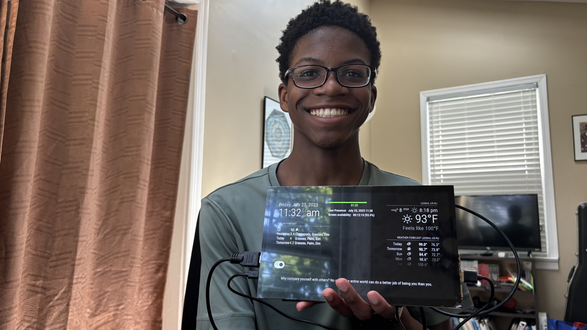

# Magic Mirror
A smart mirror is an innovative device that integrates a reflective surface with a digital display, providing real-time information such as weather updates and news. It also provides extensive customization opportunities, allowing you to display all sorts of information. This incorporates the use of a mirror with the useful features of electronic devices.

| **Engineer** | **School** | **Area of Interest** | **Grade** |
|:--:|:--:|:--:|:--:|
| Sean A | Leonia High School | Electrical Engineering | Incoming Junior |

**Replace the BlueStamp logo below with an image of yourself and your completed project. Follow the guide [here](https://tomcam.github.io/least-github-pages/adding-images-github-pages-site.html) if you need help.**



# Final Milestone

<iframe width="560" height="315" src="https://www.youtube.com/embed/gzTWQ_Vz5Ec?si=cIwCwm37H_TQqw8V" title="YouTube video player" frameborder="0" allow="accelerometer; autoplay; clipboard-write; encrypted-media; gyroscope; picture-in-picture; web-share" referrerpolicy="strict-origin-when-cross-origin" allowfullscreen></iframe>

Since my previous milestone, I managed to succesfully install and use the new 10.1" Screen Display, as well as incorporate the PIR motion sensor. Not only was I able to incorporate these modifications, but also I managed to use the motion sensor in a way that it can control the display's on/off state.

My biggest challenges with this project were probably trying to look for a case that would work with my setup, and also the installation process. I spent hours trying to search the internet to find a case that would work, but came up empty-handed. I had to resort to CAD software, which was my backup for if I couldn't find a case, however I believe this was a better option, as it allowed me to have complete customization over the case itself, and make it to my needs. 

Additionally, early on, I ran into a couple of issues when installing the MagicMirror OS onto my Raspberry Pi, as the Node.js version was incompatable with the setup program itself. Thankfully, there was a relatively simple solution by just installing Node.js manually.

BSE was very beneficial to me, as I gained an even better understanding of the implementation of programming with real electrical devices, as well as a better understanding of how different microcontrollers and embedded systems work. This project also showed me how there are so many different opportunities for customization and modifications on your prototype, and that it's up to you to create new innovative ideas.

I hope to continue growing my understanding of these topics, as well as gain more experience in working with both the hardware and software/programming sides of engineering. All in all, Bluestamp taught me many great lessons and practices to use, and I hope to grow even more.

# Second Milestone

<iframe width="560" height="315" src="https://www.youtube.com/embed/rblOZdZI_U8?si=xVBpD-ZP1toW5N28" title="YouTube video player" frameborder="0" allow="accelerometer; autoplay; clipboard-write; encrypted-media; gyroscope; picture-in-picture; web-share" referrerpolicy="strict-origin-when-cross-origin" allowfullscreen></iframe>

For my second milesotne, I polished many of the customizations/modules, and added a couple more features to it such as System information, air quality and more. By getting the base project itself done, as well as the majority of the customization stage complete, I can move on to the modification phase, in which I plan to incorporate motion-sensing capabilities, and a bigger display.

There were some previous challenges that I faced with the modules. Some were due to incompatibility issues, while others were just small errors within the modules themselves. I managed to resolve most of the issues/challenges I ran into; however, a few just seemed like they were non-functioning modules that I wouldn't be able to use (such as the `MMM-Touch` module in combination with the `MMM-pages` module). However, in the end, it was still fine, as I was able to customize my mirror/display accordingly. I encourage others who pick this project to experiment with these modules and look for possible solutions, as it would be great to find ways to resolve these issues. I also installed `pm2`, which is a JavaScript-based process manager, which allows for easy automation/startup of the MagicMirror Program.

For my final milestone, I plan to complete the assembly process of the modifications to my project and fully incorporate them. At this point, I am in a good place, with the base project being completed and customized to my liking.


# First Milestone

<iframe width="560" height="315" src="https://www.youtube.com/embed/eRlc9itsqys?si=54tGyHwXDZxcFkUZ" title="YouTube video player" frameborder="0" allow="accelerometer; autoplay; clipboard-write; encrypted-media; gyroscope; picture-in-picture; web-share" referrerpolicy="strict-origin-when-cross-origin" allowfullscreen></iframe>

My project is the MagicMirror, which combines the use of a mirror with a personal assistant. The initial components that I used were a Raspberry Pi 4, which is used to power the Mirror, and a 7" LCD Screen, to display it on. The LCD Screen connects to the Raspberry Pi via an HDMI connection. So far, I managed to install the MagicMirror Operating System on the Raspberry Pi itself, with both Node.js and npm. I also managed to connect the Pi to the screen, and I plan to customize the display to include useful information such as the weather, the time, and CPU information.

One challenge that I faced arose when I tried to use the `MMM-Touch` module, as it seemed that even though the display came with touchscreen capabilities, the module wouldn't receive or recognize any of the inputs I gave (by touching the screen). I decided to just go through without using `MMM-Touch`, as there were other modules that also used touch-recognition that worked fine. I plan to try and experiment with it a little more in future milestones; however, for now, I am at a good place.

I plan to add at least a couple of modifications to my MagicMirror, such as motion sensing capabilities, Bluetooth, and possibly more.

# Schematics 
Here's where you'll put images of your schematics. [Tinkercad](https://www.tinkercad.com/blog/official-guide-to-tinkercad-circuits) and [Fritzing](https://fritzing.org/learning/) are both great resources to create professional schematic diagrams, though BSE recommends Tinkercad because it can be done easily and for free in the browser. 

# Code
Here's where you'll put your code. The syntax below places it into a block of code. Follow the guide [here]([url](https://www.markdownguide.org/extended-syntax/)) to learn how to customize it to your project needs. 

Below is the `./config/config.js` file
```js
/* Config Sample
 *
 * For more information on how you can configure this file
 * see https://docs.magicmirror.builders/configuration/introduction.html
 * and https://docs.magicmirror.builders/modules/configuration.html
 *
 * You can use environment variables using a `config.js.template` file instead of `config.js`
 * which will be converted to `config.js` while starting. For more information
 * see https://docs.magicmirror.builders/configuration/introduction.html#enviromnent-variables
 */
let config = {
	address: "localhost",	// Address to listen on, can be:
							// - "localhost", "127.0.0.1", "::1" to listen on loopback interface
							// - another specific IPv4/6 to listen on a specific interface
							// - "0.0.0.0", "::" to listen on any interface
							// Default, when address config is left out or empty, is "localhost"
	port: 8080,
	basePath: "/",	// The URL path where MagicMirror² is hosted. If you are using a Reverse proxy
									// you must set the sub path here. basePath must end with a /
	ipWhitelist: ["127.0.0.1", "::ffff:127.0.0.1", "::1"],	// Set [] to allow all IP addresses
									// or add a specific IPv4 of 192.168.1.5 :
									// ["127.0.0.1", "::ffff:127.0.0.1", "::1", "::ffff:192.168.1.5"],
									// or IPv4 range of 192.168.3.0 --> 192.168.3.15 use CIDR format :
									// ["127.0.0.1", "::ffff:127.0.0.1", "::1", "::ffff:192.168.3.0/28"],

	useHttps: false,			// Support HTTPS or not, default "false" will use HTTP
	httpsPrivateKey: "",	// HTTPS private key path, only require when useHttps is true
	httpsCertificate: "",	// HTTPS Certificate path, only require when useHttps is true

	language: "en",
	locale: "en-US",   // this variable is provided as a consistent location
			   // it is currently only used by 3rd party modules. no MagicMirror code uses this value
			   // as we have no usage, we  have no constraints on what this field holds
			   // see https://en.wikipedia.org/wiki/Locale_(computer_software) for the possibilities

	logLevel: ["INFO", "LOG", "WARN", "ERROR"], // Add "DEBUG" for even more logging
	timeFormat: 12,
	units: "imperial",

	modules: [
		{
			module: "MMM-Remote-Control",
			config: {}
		},
		{
			module: "MMM-Pir",
			position: "top_center",
			config: {
				Display: {
					style: 2,
					mode: 3,
				},
				Pir: {
					gpio: 23,
					triggerMode: "H",
				},
				Cron: {
					mode: 3,
					ON: [
						// Turn on Monday through Friday at 6:00 AM
						{
							dayOfWeek: [1, 2, 3, 4, 5],
							hour: 6,
							minute: 0,
						},
						// Turn on Saturday and Sunday at 7:00 AM
						{
							dayOfWeek: [0, 6],
							hour: 7,
							minute: 0,
						}
					],
					OFF: [
						// Turn off every day at 10:15 PM
						{
							dayOfWeek: [0, 1, 2, 3, 4, 5, 6],
							hour: 22,
							minute: 15,
						},
					],
				},
				Touch: {
					mode: 3
				},
			}	
		},
		{
			module: "alert",
			positition: "top_bar",
		},
		{
			module: "updatenotification",
			position: "top_center"
		},
		{
			module: "clock",
			position: "top_left"
		},
/* 		{
			module: "calendar",
			header: "US Holidays",
			position: "top_left",
			config: {
				calendars: [
					{
						fetchInterval: 7 * 24 * 60 * 60 * 1000,
						symbol: "calendar-check",
						url: "https://ics.calendarlabs.com/76/mm3137/US_Holidays.ics"
					}
				]
			}
		}, */
		{
			module: "MMM-Pollen",
			position: "top_left",
			header: "Pollen Forecast",
			config: {
				zipCode: "07605",
				updateInterval: 60 * 60 * 1000, // Update every hour
			}
		},
		{
			module: "weather",
			position: "top_right",
			config: {
				weatherProvider: "openmeteo",
				type: "current",
				roundTemp: true,
				degreeLabel: true,
				lat: 40.86190216978815,
				lon: -73.98366785585593
			}
		},
		{
			module: "weather",
			position: "top_right",
			header: "Weather Forecast",
			config: {
				weatherProvider: "openmeteo",
				type: "forecast",
				lat: 40.86190216978815,
				lon: -73.98366785585593
			}
		},
		/* {
			module: 'MMM-AQI',
			position: 'top_right',
			header: 'Air Quality Index (AQI)',
			config: {
				token: "YOUR API TOKEN HERE",
				city: "here",
				iaqi: true,
				updateInterval: 30 * 60 * 1000, // Every half hour.
				initialLoadDelay: 0,
				animationSpeed: 1000,
				debug: false
			}
		}, */
		/* {
			module: "MMM-PiTemp",
			position: "bottom_right",
			config: {
				tempUnit: "F",
				high: 196,
				low: 158,
				label: "CPU: "
			}
		}, */
		{
			module: "MMM-HideAll",
			position: "bottom_left",
			config: {
				hidetext: "",
				showtext: "",
				fadespeed: 1000,
				vishidden: 0.3,
				symbolhide: "toggle-off",
				symbolshow: "toggle-on"
			}
		},
/* 		{
			module: "MMM-pages",
			config: {
				timings: {
					default: 5000,
					0: 10000,
				},
				modules: [
					[]
				],
				fixed: [
					// "clock",
					"weather",
					"MMM-HideAll",
				]

			}
		},
		{
			module: "MMM-page-indicator",
			position: "bottom_bar",
			config: {
				activeBright: true,
				inactiveHollow: false,
			}
		} */
		{
			module: "MMM-quote-of-the-day",
			position: "bottom_bar",
			config: {
				feeds: {
					langauge: "en",
					updateInterval: "1d"
				},
			}
		},
/* 		{
			module: "MMM-Touch",
			position: "fullscreen_above",
			config: {
				gestureCommands: {

				},
				onIdle: () => { this.sendNotification("TOUCH_IDLE_TRIGGERED", {}); console.log("Touch Idle Triggered"); },
			},
		}, */
	]
};

/*************** DO NOT EDIT THE LINE BELOW ***************/
if (typeof module !== "undefined") { module.exports = config; }
```

And here is the `./css/custom.css` file (can be used for further customizing the look of modules):
```css
.hide-toggle{
	border: 0px solid #FFF;
}

.hide-toggle div{
	position: absolute;
		top: 0px;
		right: 0px;
		bottom: 0px;
		left: 0px;
	font-size: 55px;
}

#pi_temp{
	font-size: 40px;
}
```

I added more automation to the startup process of the MagicMirror via the following below:

I added the following to my `~/.bashrc` file (which is the file that runs on startup of the Pi:
```bash
if [ -f ~/.bash_functions ]; then
    . ~/.bash_functions
fi
```
I also created an additional file in my home directory named `.bash_functions` in which I defined custom functions for launching the MagicMirror:
```bash
#!/bin/bash

function startmm() {
    { #try
        pm2 start ~/mm.sh
    } || { #catch
        echo "Error starting MagicMirror. Please check the logs."
        exit 1
    }
}

function stopmm() {
    { #try
        pm2 stop ~/mm.sh
    } || { #catch
        echo "Error stopping MagicMirror. Please check the logs."
        exit 1
    }
}

function restartmm() {
    { #try
        pm2 restart ~/mm.sh
    } || { #catch
        echo "Error restarting MagicMirror. Please check the logs."
        exit 1
    }
}

function reloadmm() {
    { #try
        pm2 reload ~/mm.sh
    } || { #catch
        echo "Error reloading MagicMirror. Please check the logs."
        exit 1
    }
}

function activate_venv() {
    source ~/.venv/bin/activate
}

function deactivate_venv() {
    deactivate
}
```


# Bill of Materials

| **Part** | **Note** | **Price** | **Link** |
|:--:|:--:|:--:|:--:|
| Raspberry Pi 4 Starter Kit | Power's the display for the smart mirror | $96.99 | <a href="https://www.amazon.com/RasTech-Raspberry-Starter-Heatsink-Screwdriver/dp/B0C8LV6VNZ"> Link </a> |
| (7") LCD Display | Used for displaying the MagicMirror | $45.99 | <a href="https://www.amazon.com/Hosyond-Display-1024%C3%97600-Capacitive-Raspberry/dp/B09XKC53NH/"> Link </a> |
| Wireless Keyboard and Mouse | (Optional) Used to interact with the Raspberry Pi directly without having to go through SSH / navigating the mirror directly | $29.99 | <a href="https://www.amazon.com/Logitech-MK270-Wireless-Keyboard-Mouse/dp/B079JLY5M5"> Link </a> |
| (5Pcs) HC-SR501 PIR Motion Sensor | Motion sensor used to detect motion (and manipulate the mirror display state) | $8.99 | <a href="https://www.amazon.com/WWZMDiB-HC-SR501-Exclusive-Raspberry-Electronic/dp/B0CCF3HYT9/"> Link </a> |
| Raspberry Pi. 10.1 in. Screen Monitor | Bigger screen for more accessibility | $69.99 | <a href="https://www.amazon.com/dp/B0987468N2/"> Link </a> |


# Other Resources
- [MagicMirror Docs/Guide](https://docs.magicmirror.builders/)
- [MagicMirror Wiki](https://github.com/MagicMirrorOrg/MagicMirror/wiki)
- [3rd Party Modules](https://github.com/MagicMirrorOrg/MagicMirror/wiki/3rd-party-modules)
